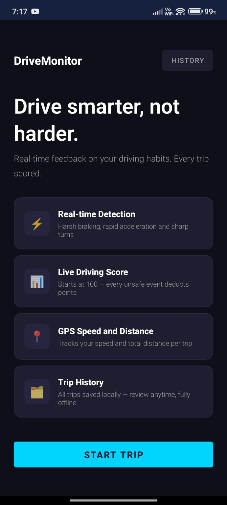
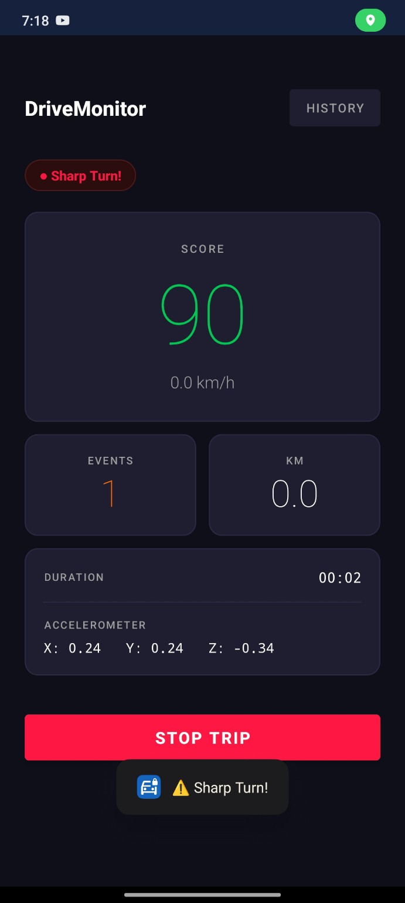
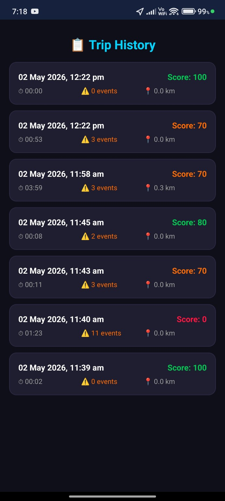

# 🚗 Driving Behavior Monitor

An Android app that detects unsafe driving patterns in real time using your phone’s built-in sensors — no extra hardware required.

---

##  Download APK
 [Download & Install App](https://drive.google.com/file/d/1elBoR2TNJYm2E2BdDzOCu9MxYOs8aZw8/view?usp=sharing)

---

##  Screenshots

  
  
  

---

## 🚀 Features

-  **Real-Time Sensor Monitoring**  
  Tracks accelerometer and GPS data continuously during trips

-  **Unsafe Driving Detection**  
  Detects harsh braking, rapid acceleration, and sharp turns using threshold logic

- **Instant Alerts**  
  Provides real-time visual alerts for unsafe driving behavior

-  **Live Driving Score**  
  Starts from 100 and updates dynamically based on driving events

-  **GPS Tracking**  
  Monitors speed and distance travelled in real time

-  **Trip History (Offline)**  
  Stores all trips locally using SQLite for later analysis

-  **Clean UI Dashboard**  
  Displays speed, score, events, and trip duration in an intuitive layout

---

## 🛠 Tech Stack

- **Language:** Java
- **Framework:** Android SDK
- **Database:** SQLite
- **APIs:** SensorManager, FusedLocationProviderClient
- **UI:** XML, Material Design

---

## ⚙️ How It Works

1. App reads accelerometer + GPS data in real time
2. Applies filtering to reduce sensor noise
3. Detects unsafe events using predefined thresholds
4. Updates driving score dynamically
5. Stores trip data locally for future analysis

---

⭐ If you like this project, consider giving it a star!
